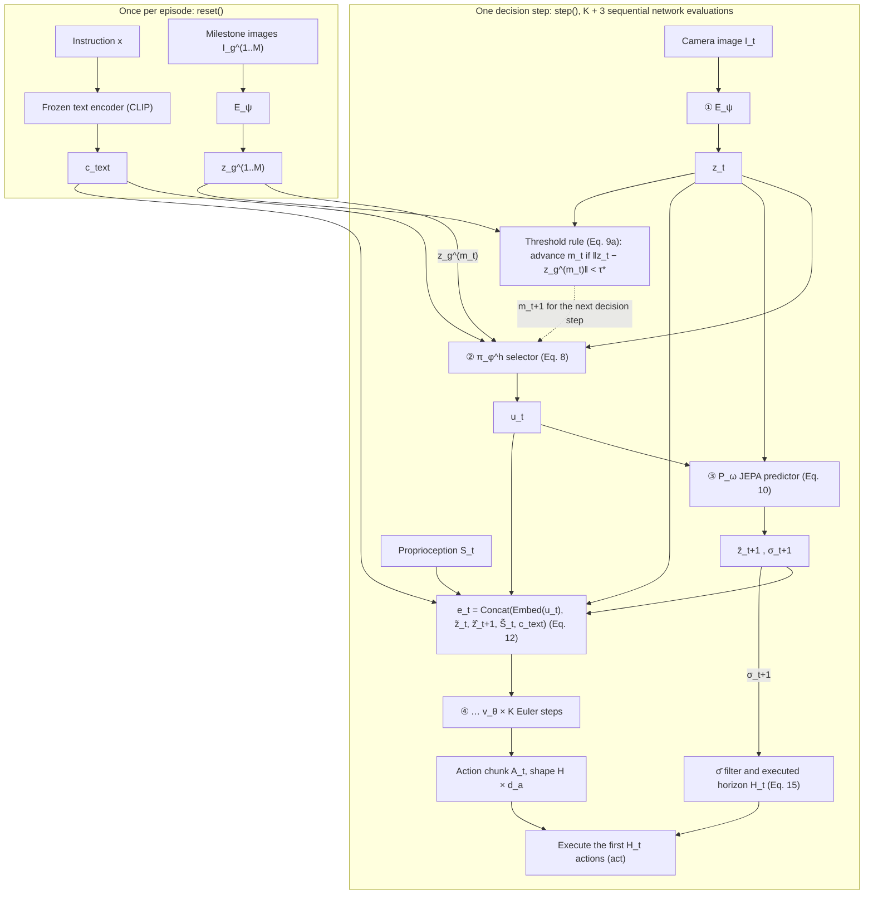

# Vision-Predictor-Action (VPA)

A PyTorch reference implementation of a goal-conditioned robot control loop that plans in a learned latent space, picks a symbolic skill, and generates a whole action chunk with a few flow-matching steps.

[](LICENSE)
[](https://doi.org/10.5281/zenodo.22960919)
[](https://www.python.org/downloads/)
[](https://pytorch.org)

## About

Many Vision-Language-Action (VLA) models emit robot actions token by token through a large language model.
The number of sequential forward passes then grows with the length of the action sequence, which limits how fast
the robot can react. **Vision-Predictor-Action (VPA)** removes that autoregressive decoder and splits the problem in two:

- **High-level intent**: a small classifier picks a discrete skill ("primitive", e.g. *reach*, *grasp*) and a
  symbolic rule tracks progress through a sequence of goal images ("milestones").
- **Low-level motion**: a continuous generator produces an entire chunk of H future actions at once.

The pipeline has four stages:

1. **Encoders.** A shared vision encoder maps camera images and milestone images into a compact latent space, and a
   small frozen text encoder (CLIP) embeds the natural-language instruction.
2. **Neuro-symbolic selector.** An MLP chooses the active primitive from the current latent, the active milestone
   latent and the text embedding. A milestone counts as reached when the latent distance falls below a threshold.
3. **JEPA predictor.** A *Joint-Embedding Predictive Architecture* predicts the *latent* of the next observation
   instead of its pixels, so no image decoder is needed. A small ensemble also gives an uncertainty estimate σ.
   Training uses VICReg-style variance and covariance penalties so the latents cannot collapse to a constant.
4. **Flow-matching solver.** *Flow matching* learns a velocity field that transports Gaussian noise into an action
   chunk; sampling integrates that field with K Euler steps (K ∈ {1, 2, 3}). The predictor's uncertainty decides how
   many of the H generated actions are executed before replanning.

Because the whole chunk is produced in K steps, one decision step needs **K + 3 sequential network evaluations,
independent of the chunk length H** (Proposition 5.1 of the paper).

This repository is the **official reference implementation** of the preprint
*Vision-Predictor-Action: Towards Efficient Embodied AI via Neuro-Symbolic JEPA Predictors*
([doi:10.5281/zenodo.22960919](https://doi.org/10.5281/zenodo.22960919)).
A copy of the preprint is included at [`docs/preprint_261008.pdf`](docs/preprint_261008.pdf).

## Status

> [!IMPORTANT]
> **This is an untrained research prototype with equation-level verification.**
> Every network has random weights. The self-tests check each equation of the paper against independent reference
> computations, but **no task-level results are claimed**: there are no trained models, no success rates and no
> comparisons with other methods. The empirical evaluation described in Section 6 of the paper is future work, which
> matches the paper's own statement that no empirical results are reported.

## Architecture

One decision step, following Fig. 2 of the paper:



The milestone latents z_g^(m) and the text embedding c_text are computed once per episode, so the per-step chain is
E_ψ → π_φ^h → P_ω → v_θ (K times): **K + 3 sequential evaluations regardless of H** (Proposition 5.1).
`VPAInferencePipeline.step` audits this sequence at runtime with forward hooks and raises if it differs.

## Equation-to-code map

| Paper | File | Class / function |
|---|---|---|
| Eq. 7, shared (Siamese) vision encoder E_ψ | `perception.py` | `VisionEncoder.forward`, `encode_milestones`, `encode_siamese` (one camera, or V views fused in the head; see [Camera views](#camera-views-one-or-two-cameras)) |
| Text embedding c_text (Sec. 4.1) | `perception.py` | `TextEncoderWrapper` |
| Momentum target E_ψ̄ and stop-gradient (Eq. 11, Fig. 3) | `perception.py` | `MomentumEncoder.update`, `MomentumEncoder.forward` |
| Eq. 8, primitive selection | `selector.py` | `NeuroSymbolicSelector.select` (`forward`, `probabilities`, `loss`) |
| Eq. 9a, milestone pointer | `selector.py` | `MilestoneTracker.step`, `completion_test`, `active_goal` |
| Eq. 9b, running variance margin γ̄ | `selector.py` | `MilestoneTracker.update_variance_margin`, `instantaneous_margin` |
| Eq. 9c, threshold τ and deployment τ* | `selector.py` | `MilestoneTracker.threshold`, `freeze` |
| Eq. 10, latent predictor | `predictor.py` | `JEPAPredictor.forward`, `forward_heads` |
| σ definition (Sec. 4.3) | `predictor.py` | `JEPAPredictor.ensemble_uncertainty` |
| Eq. 11, JEPA objective | `predictor.py` | `VICRegLoss.forward`, `invariance`, `anti_collapse` |
| Eq. 12, conditioning vector e_t | `solver.py` | `FlowMatchingSolver.build_conditioning` |
| Sec. 4.5, fixed standardization | `solver.py` | `standardize_latents`, `standardize_proprioception`, `FlowMatchingSolver.set_standardization_stats` |
| Eqs. 13–14, flow-matching path and loss | `solver.py` | `FlowMatchingSolver.flow_matching_loss` |
| Euler update (Sec. 4.4) | `solver.py` | `FlowMatchingSolver.generate_chunk` (v_θ is `ConditionalVectorField`) |
| Eq. 15, σ̄ filter and executed horizon H_t | `solver.py` | `UncertaintyHorizonFilter.filter`, `horizon`, `update`; `executed_prefix_mask` |
| Eq. 16, autoregressive VLA latency | — | Analysis only; no VLA baseline is implemented |
| Eq. 17, per-stage latency | `bench_latency.py` | measures t_E, t_h, t_P, t_l(H) |
| Eq. 18, variance hinge v(Z) | `predictor.py` | `VICRegLoss.variance` |
| Eq. 19, covariance penalty c(Z) | `predictor.py` | `VICRegLoss.covariance` |
| Prop. 5.1, K + 3 sequential depth | `pipeline.py` | `VPAInferencePipeline.step` (runtime hook audit) |
| Fig. 2, closed loop; shared γ̄* | `pipeline.py` | `VPAInferencePipeline.reset`, `step`, `act`, `calibrate` |

## Installation

Tested on macOS 15 with an Apple M4 (Apple Silicon, MPS backend) and Python 3.13. Python ≥ 3.10 is required.

```bash
git clone <this repository> vpa-pytorch
cd vpa-pytorch
python3 -m venv .venv
source .venv/bin/activate
pip install --upgrade pip
pip install -r requirements.txt        # torch==2.14.1, transformers==5.19.0
pip install -r requirements-dev.txt    # optional: adds ruff for linting
python -c "import torch; print(torch.__version__, torch.backends.mps.is_available())"
```

**Linux / CUDA users:** install PyTorch first by following the instructions at
[pytorch.org](https://pytorch.org/get-started/locally/) for your CUDA version (ideally torch 2.14.1), then run
`pip install -r requirements.txt`. Only macOS on Apple M4 has been tested.

## Quick start

The modules are plain files, not an installed package, so run Python **from the repository root**.
This example builds the full pipeline with the default (placeholder) sizes and random weights, and runs the
control loop for ten steps:

```python
import torch
from pipeline import VPAConfig, VPAInferencePipeline

device = "mps" if torch.backends.mps.is_available() else "cpu"
cfg = VPAConfig()  # placeholder sizes; all weights are random (untrained)

# Builds every module; the first run downloads openai/clip-vit-base-patch32 from Hugging Face.
pipe = VPAInferencePipeline.from_config(cfg).to(device)

# Install the frozen statistics that would come from training: gamma*, mu_Z, mu_S, sigma_S.
# Dummy values here.
tau_star = pipe.calibrate(
    1.0,
    torch.zeros(cfg.latent_dim),
    torch.zeros(cfg.proprio_dim),
    torch.ones(cfg.proprio_dim),
)

# One episode: an instruction plus M = 2 milestone goal images, shape [B, M, C, H, W].
milestones = torch.rand(1, 2, 3, 224, 224, device=device)
pipe.reset("pick up the red cup and place it on the plate", milestones)

for t in range(10):
    frame = torch.rand(1, 3, 224, 224, device=device)        # camera image I_t, [B, C, H, W]
    state = torch.zeros(1, cfg.proprio_dim, device=device)   # proprioception S_t, [B, d_s]
    out = pipe.act(frame, state)                             # out.action: [B, d_a]
    if out.step_output is not None:                          # a new action chunk was planned
        s = out.step_output
        print(f"t={t}: u_t={s.primitive.item()}, H_t={s.executed_horizon.item()}, "
              f"m_t={s.milestone_pointer.item()}, sequential evaluations={s.num_sequential_evaluations}")
```

**The first run downloads the CLIP model** (`openai/clip-vit-base-patch32`) from Hugging Face. Transformers then
prints a load report listing many `UNEXPECTED` keys: those are CLIP's *vision* tower, which VPA does not use, and
can be ignored. Only the text tower is loaded (63.4M parameters, no missing weights). Running the example on an
Apple M4 printed:

```text
t=0: u_t=7, H_t=15, m_t=1, sequential evaluations=5
```

`act` replanned only at t = 0 because H_t = 15 of the 16 generated actions are executed before the next decision
step. The exact primitive and H_t vary from run to run because the weights are random. `sequential evaluations=5`
is K + 3 with the default K = 2.

## Camera views (one or two cameras)

The paper writes the observation I_t as a single frame. That is the default here: one camera,
`agentview_rgb` on LIBERO, frames `[B, C, H, W]`. The code can also take I_t as the tuple of V camera views,
for example the third-person and the wrist camera, so that both settings can be trained and reported with the
same code:

| | one camera (default) | two cameras |
|---|---|---|
| `train.py` | `--camera-keys agentview_rgb` (or nothing) | `--camera-keys agentview_rgb eye_in_hand_rgb` |
| `VPAConfig.num_views` | 1 | 2 (set from the data) |
| observation I_t | `[B, C, H, W]` | `[B, V, C, H, W]` |
| milestones I_g^(1..M) | `[B, M, C, H, W]` | `[B, M, V, C, H, W]` |
| E_ψ | ViT → [CLS] → linear head | the same ViT body on every view → [CLS] tokens concatenated in camera order → linear head |

- **Only the encoder's input changes.** E_ψ is still one map from an observation to z ∈ ℝ^d, so Eqs. 8–15, 18 and
  19 and every module after the encoder are untouched. One ViT body is shared by all views, just as it is
  shared by observations and milestones, and the head maps the concatenated [CLS] tokens:
  E_ψ(I) = W · Concat(f(I¹), …, f(I^V)) + b. With V = 2 the head has 2 × 384 inputs instead of 384 (+98k parameters).
- **The depth stays K + 3.** The views go through the body as one batch inside a single E_ψ call, so the hook audit
  still sees `[E_ψ, π_φ^h, P_ω] + [v_θ] × K`. The encoder's cost grows roughly linearly with V; measure it with
  `bench_latency.py --num-views 2`.
- **Every frame E_ψ sees carries the same views:** I_t, the JEPA target I_{t+ν}, the milestone frames (so z_t and
  z_g come from the same map, which the Eq. 9a test needs) and the stage-2 latent cache.
- **With one camera nothing changes:** the same tensor shapes, the same parameter names and shapes, the same
  random initialization and the same outputs. `tests/regression_single_cam.py` checks this bit for bit against the
  `single-cam-baseline` tag, and checks that checkpoints written before multi-camera support still load and
  evaluate identically.
- The camera keys and their order are stored in the checkpoint. `eval.py` builds I_t from the checkpoint's
  cameras (there is no camera flag at evaluation), and continuing a checkpoint with other cameras is refused.

## Training and evaluation on LIBERO

`dataset.py` reads LIBERO's HDF5 demonstrations, `train.py` runs the two training stages (stage 1: E_ψ and P_ω
with Eq. 11; stage 2: π_φ^h and the solver on frozen latents) and `eval.py` runs closed-loop episodes in LIBERO.
Training needs `h5py`; evaluation needs LIBERO and its simulator (see the docstring of `eval.py`).

```bash
# one camera (the paper's setting)
python train.py --data /path/to/LIBERO/datasets/libero_10 --out runs/libero10_1cam
python eval.py --checkpoint runs/libero10_1cam/policy_final.pt --suite-name libero_10 --num-trials-per-task 50 \
    --out eval_results/libero10_1cam

# two cameras: the same command plus --camera-keys
python train.py --data /path/to/LIBERO/datasets/libero_10 --out runs/libero10_2cam \
    --camera-keys agentview_rgb eye_in_hand_rgb
python eval.py --checkpoint runs/libero10_2cam/policy_final.pt --suite-name libero_10 --num-trials-per-task 50 \
    --out eval_results/libero10_2cam
```

**Camera ablation.** `scripts/camera_ablation.sh` trains and evaluates both settings for several seeds with
otherwise identical settings (50 episodes per task, one evaluation seed), times both encoders with
`bench_latency.py`, and writes a summary table with `scripts/summarize_ablation.py` (success mean ± std over
seeds, pooled rate with a Wilson 95% interval, per-task rates, the premature Eq. 9a completion rate, and the
two-camera minus one-camera difference paired by seed):

```bash
DATA=/path/to/LIBERO/datasets/libero_10 bash scripts/camera_ablation.sh
DATA=... TRAIN_ARGS="--init-encoder dinov2-small --encoder-lr 1e-4" bash scripts/camera_ablation.sh
```

## Testing

Each module has a self-test, run on CPU, deterministic (fixed seeds) and offline (an offline stand-in replaces CLIP).
Run them in dependency order, pipeline last:

```bash
for f in perception selector predictor solver pipeline; do python "$f.py" || break; done
ruff check --select F,E9,B,PLE,PLW .
```

Expected output:

```text
perception.py self-test passed
selector.py self-test passed
predictor.py self-test passed
solver.py self-test passed
pipeline.py self-test passed
All checks passed!
```

The data, training and evaluation code has its own self-tests on synthetic LIBERO-format files (they need
`h5py`; the evaluation test uses a fake environment, so LIBERO is not needed), and the single-camera regression
test compares this tree with the `single-cam-baseline` tag:

```bash
python dataset.py && python pretrained_encoder.py && python train.py --self-test && python eval.py --self-test
git tag single-cam-baseline 5729a11 2>/dev/null || true   # once: the commit before multi-camera support
python tests/regression_single_cam.py                     # PASS = single-camera outputs are bit-identical
```

The tests compare float32 module output with **independent float64 reference computations** written directly from
the paper's formulas (explicit loops, not the code under test), at `rtol=1e-5, atol=1e-6`:

- **`perception.py`**: a hand-written float64 ViT forward for Eq. 7; Siamese batching equals separate encoding;
  five EMA updates of the momentum encoder against a hand loop; stop-gradient; the frozen text encoder stays frozen.
- **`selector.py`**: the Eq. 8 MLP input is exactly `concat(z_t, z_g, c_text)` and `select` is its argmax;
  Eq. 9b over 12 random batches against an explicit unbiased-variance EMA; Eq. 9c before and after `freeze`;
  Eq. 9a at the exact boundary (distance = τ does not advance), with M = 1, and in a 40-step masked randomized run.
- **`predictor.py`**: each ensemble head against a per-head loop; σ against an explicit loop and exactly 0 for
  identical heads; Eqs. 18 and 19 with loops; Proposition 5.2 (i) collapsed batch gives v = γ − √ε, c = 0;
  Proposition 5.2 (ii) whitened batch with B > d gives v = c = 0 and positive-definite covariance;
  Eq. 11 for mean and sum over heads, with no gradient reaching the target.
- **`solver.py`**: the slots of e_t (Eq. 12, Sec. 4.5); Eqs. 13–14 against a replayed generator;
  Euler integration for every K ∈ {1, 2, 3} against hand loops; K evaluations of v_θ for H ∈ {4, 16, 64};
  the Eq. 15 filter (immediate rise, gradual decay, masked elements frozen) and H_t including the H_min clamp.
- **`pipeline.py`**: the call order is exactly `[E_ψ, π_φ^h, P_ω] + [v_θ] × K` with depth K + 3 for every K and
  H ∈ {4, 16, 64}; `step` equals a manual run of the modules; calibration installs one γ̄* everywhere;
  a 60-step pointer rollout; per-element replanning in `act` over 60 calls; a hidden extra or missing network call
  raises and commits no state.

## Latency

> **Random weights; latency only; not a task-performance result.**

`bench_latency.py` measures the components of Eq. 17, T_VPA = t_E + t_h + t_P + K · t_l(H), inside the real `step()`.
Each stage is timed with forward hooks and `torch.mps.synchronize()` before every clock read. Numbers are medians
of 100 runs after 10 warm-up runs, in milliseconds.

- **Hardware:** Mac mini (Mac16,10), Apple M4 (10-core CPU), 32 GB memory, macOS 15.3.1, PyTorch 2.14.1, MPS
  backend, batch size 1, float32.
- **Configuration:** `VPAConfig()` defaults (placeholders, not values from the paper), with H and K swept.
  - E_ψ: ViT, 224×224 input, patch 16, width 384, depth 6, 6 heads, latent d = 256 — 11.12M parameters.
  - π_φ^h: MLP 512-512, 8 primitives — 0.79M parameters.
  - P_ω: 5 ensemble heads, hidden 512 × 2 — 2.79M parameters.
  - v_θ: transformer width 256, depth 4, 4 heads, d_a = 8 — 3.55M parameters at H = 8, 3.58M at H = 128
    (only the positional embedding grows with H).
  - The text encoder is not on the per-step chain (c_text is computed once per episode), so the benchmark uses an
    offline stand-in by default; `--clip` loads the real CLIP text tower (63.4M parameters).

| K | H | t_E | t_h | t_P | t_l(H) | Eq. 17 sum | step() |
|---|---|---|---|---|---|---|---|
| 1 | 8 | 3.732 | 0.333 | 0.692 | 1.473 | 6.229 | 10.481 |
| 1 | 16 | 3.766 | 0.336 | 0.711 | 1.482 | 6.295 | 10.617 |
| 1 | 32 | 3.714 | 0.334 | 0.687 | 1.485 | 6.220 | 10.484 |
| 1 | 64 | 3.740 | 0.333 | 0.692 | 1.568 | 6.333 | 10.726 |
| 1 | 128 | 3.867 | 0.337 | 0.715 | 1.865 | 6.783 | 11.166 |
| 2 | 8 | 3.756 | 0.334 | 0.701 | 1.457 | 7.707 | 12.235 |
| 2 | 16 | 3.737 | 0.335 | 0.696 | 1.453 | 7.674 | 12.140 |
| 2 | 32 | 3.748 | 0.329 | 0.697 | 1.509 | 7.793 | 12.266 |
| 2 | 64 | 3.757 | 0.328 | 0.694 | 1.583 | 7.945 | 12.409 |
| 2 | 128 | 3.752 | 0.340 | 0.707 | 1.799 | 8.397 | 12.917 |
| 3 | 8 | 3.703 | 0.331 | 0.694 | 1.443 | 9.057 | 13.730 |
| 3 | 16 | 3.719 | 0.330 | 0.697 | 1.446 | 9.084 | 13.687 |
| 3 | 32 | 3.780 | 0.337 | 0.711 | 1.524 | 9.401 | 14.205 |
| 3 | 64 | 3.739 | 0.334 | 0.705 | 1.581 | 9.521 | 14.167 |
| 3 | 128 | 3.772 | 0.331 | 0.702 | 1.799 | 10.201 | 14.847 |

How to read it:

- t_E, t_h and t_P do not depend on H, as Eq. 17 states.
- t_l(H) stays within 10% of its H = 8 value up to H = 64 and rises by 23–27% at H = 128. This matches the paper's
  statement (Proposition 5.1 (ii)) that each v_θ evaluation is roughly constant in H only while it fits within
  the available hardware parallelism.
- `step()` also includes non-network work and the synchronization overhead of the timing hooks, so it is larger
  than the Eq. 17 sum.
- The table is a single sweep. In a second sweep on the same machine, the median difference per value was 1.5%,
  55 of 60 values agreed within 5%, and the largest difference was 19% (one row, K = 1 and H = 32, was high in
  every stage, including t_E, which does not depend on H). Treat differences of that size as run-to-run noise.

Run it yourself with `python bench_latency.py` (options: `--runs`, `--warmup`, `--device mps|cuda|cpu`, `--clip`,
`--num-views 2` for the two-camera encoder, `--config-json runs/<run>/config.json` for the sizes of a trained run).

## Design choices where the paper is silent

The paper fixes the equations but leaves some details open. This implementation makes the following choices
(copied from [`CLAUDE.md`](CLAUDE.md), which the code follows):

- γ̄₀ = the first instantaneous estimate (unless `gamma_bar_init` is given).
- The invariance term is averaged over ensemble heads (`head_reduction="mean"`; `"sum"` is available).
- Selection at step t uses m_t; m_{t+1} applies from the next decision step.
- σ̄ starts at 0 each episode, so the first step has σ̄ = σ.
- c_text is not standardized; Sec. 4.5 only names the latents and S_t.
- `VPAConfig` defaults and the EMA momentum (0.996) are placeholders, not values from the paper.
- The per-milestone time-out (deferred in Sec. 4.2/6) and spectral normalization (optional,
  Sec. 5.3) are intentionally not implemented.

**Pipeline and episode semantics**

- The pointer starts at m₀ = 1. At most one milestone advances per decision step; the Eq. 9a test
  runs only at decision steps, never during chunk execution.
- Order inside `step`: Eq. 15 filter, then Eq. 9a, both on the same z_t, after the K + 3 chain.
  Nothing is committed if the depth audit fails.
- Completion only sets a sticky `task_complete` flag. The step that completes still generates and
  commits a chunk, and `act` keeps returning actions; ending the episode is the caller's job.
- Batches replan asynchronously: the networks run on the whole batch, but σ̄, m_t, the chunk, H_t
  and the cursor are committed only where `decision_mask` is set. The first step must include every
  element. (The paper describes a single agent.)
- Ties in Eq. 8 go to the lowest primitive index (`torch.argmax`).
- `calibrate` freezes only E_ψ and P_ω (Sec. 4.3); selector and solver stay trainable but are put
  in eval mode.
- ν is validated (1 ≤ ν ≤ H_min) but unused at inference; it only matters for aligning training
  targets.
- The ε of Eq. 9b and Eq. 18 must be the same value. `VPAConfig.vicreg_eps` sets the tracker's ε;
  build the loss with `VPAInferencePipeline.make_vicreg_loss`, or verify an external one with
  `check_vicreg_loss`. (`VICRegLoss` can't read `VPAConfig` itself because of module independence.)

**Numerics and estimators**

- The ensemble mean ẑ is computed as `ẑ⁽¹⁾ + mean_i(ẑ⁽ⁱ⁾ − ẑ⁽¹⁾)`: the same mean in exact arithmetic,
  but σ is exactly 0 when all heads agree.
- Eq. 14 is a one-sample Monte Carlo estimate per batch element: one ξ and one ρ per call, with
  ρ drawn from `torch.rand`, i.e. [0, 1).
- S̃ uses a per-dimension σ_S vector; latents use the scalar γ̄* and a per-dimension μ̄_Z.
- float32 everywhere on the forward path (MPS). So ρ_k = 1/3 is rounded inside v_θ, γ̄ is computed in
  float32 even for float64 input, and the H_t floor can differ from exact arithmetic by one exactly
  at an integer boundary.

**Camera views**

- The paper's I_t is one frame; that is the default (V = 1). With V ≥ 2 cameras, I_t and every milestone
  frame are the tuple of the same views in the same order (`--camera-keys` order), and E_ψ is a shared ViT body
  on each view with one linear head on the concatenated [CLS] tokens (no per-view weights, no learned view
  embedding: the head tells the views apart by their position). See [Camera views](#camera-views-one-or-two-cameras).
- All views get the same preprocessing (LIBERO renders the wrist camera upside down too, so the 180° rotation
  applies to every view) and must have the same stored frame size.

**Architectures the paper leaves open**

- E_ψ: pre-norm ViT; the latent is a linear head on the final LayerNorm'd [CLS] token (on the concatenated
  [CLS] tokens of the views when V ≥ 2).
- E_ψ̄: starts as an exact copy of ψ; buffers are copied, not EMA-averaged (the ViT has none).
- c_text: CLIP's projected `text_embeds`, not L2-normalized, padded and truncated at 77 tokens.
- P_ω: N_e GELU-MLP heads, each with its own primitive embedding (N(0,1) init, separate from the
  solver's Embed in Eq. 12), weights U(±1/√in).
- v_θ: non-causal pre-norm transformer over the H positions, with a prepended conditioning token
  plus an additive broadcast of MLP(e_t, time(ρ)); sinusoidal ρ features scaled by 1000.

## Not yet implemented / roadmap

- **Trained models and results.** LIBERO data loading, the two-stage training loop and closed-loop LIBERO
  evaluation exist (`dataset.py`, `train.py`, `eval.py`, one or two cameras), but no trained checkpoints or
  success rates are published yet.
- **Section 6 evaluation** in simulation (NVIDIA Isaac Sim, ManiSkill3): task success, latency on target hardware,
  encoder-regularity constants and phase-onset residuals.
- **Per-milestone time-out** for detecting stalled milestones (deferred in Secs. 4.2 and 6 of the paper).
- **Spectral normalization** of the encoder (optional in Sec. 5.3).

## Repository layout

```text
vpa-pytorch/
├── perception.py         # Stage 1: VisionEncoder (E_ψ), MomentumEncoder (E_ψ̄), TextEncoderWrapper (c_text)
├── selector.py           # Stage 2: NeuroSymbolicSelector (π_φ^h), MilestoneTracker (m_t, γ̄, τ)
├── predictor.py          # Stage 3: JEPAPredictor (P_ω, σ), VICRegLoss (Eqs. 11, 18, 19)
├── solver.py             # Stage 4: FlowMatchingSolver (Eq. 12, v_θ, Euler), UncertaintyHorizonFilter (Eq. 15)
├── pipeline.py           # VPAConfig, VPAInferencePipeline (reset, step, act, calibrate)
├── dataset.py            # LIBERO HDF5 demonstrations (one or several camera views)
├── train.py              # two-stage training (stage 1: E_ψ, P_ω; stage 2: π_φ^h, solver), --camera-keys
├── eval.py               # closed-loop LIBERO evaluation, Eq. 15 options (--fixed-horizon, --beta, --suggest-beta)
├── eval_fixed_horizon.py # forwards to eval.py (kept so older commands keep working)
├── pretrained_encoder.py # optional DINOv2 initialisation of E_ψ (--init-encoder)
├── bench_latency.py      # Eq. 17 latency benchmark (not part of the self-tests)
├── tests/
│   ├── regression_single_cam.py   # single-camera outputs must be bit-identical to the single-cam-baseline tag
│   └── dump_reference_outputs.py  # deterministic outputs of one source tree (used by the regression test)
├── scripts/
│   ├── camera_ablation.sh         # one vs two cameras: train, evaluate, benchmark, summarize
│   └── summarize_ablation.py      # success table from eval_metrics.json files
├── requirements.txt      # torch, transformers (pinned)
├── requirements-dev.txt  # + ruff
├── CLAUDE.md             # development rules and design decisions
├── CITATION.cff
├── LICENSE               # GPL-3.0
└── docs/
    ├── README.md         # license note for the preprint
    └── preprint_261008.pdf
```

## Citation

If you use this code or build on VPA, please cite the preprint:

```bibtex
@misc{lee2026vpa,
  author    = {Lee, Yeonseok},
  title     = {Vision-Predictor-Action: Towards Efficient Embodied AI via Neuro-Symbolic JEPA Predictors},
  year      = {2026},
  publisher = {Zenodo},
  doi       = {10.5281/zenodo.22960919},
  url       = {https://doi.org/10.5281/zenodo.22960919},
  note      = {Preprint}
}
```

GitHub also reads [`CITATION.cff`](CITATION.cff) and shows a "Cite this repository" button.

## Acknowledgements

We extend our sincere gratitude to the [starVLA](https://github.com/starVLA/starVLA) and [V-JEPA 2](https://github.com/facebookresearch/vjepa2) projects for their invaluable open-source contributions. We also thank the developers of [LIBERO](https://github.com/Lifelong-Robot-Learning/LIBERO), [CALVIN](https://github.com/mees/calvin), [OpenVLA](https://github.com/openvla/openvla), [VLA-Adapter](https://github.com/OpenHelix-Team/VLA-Adapter), [Qwen-VL](https://github.com/QwenLM/Qwen-VL), [NS-VLA](https://github.com/Zuzuzzy/NS-VLA), and [VLA-JEPA](https://github.com/ginwind/VLA-JEPA) for their open-source contributions. This implementation is built on [PyTorch](https://pytorch.org), [Hugging Face Transformers](https://github.com/huggingface/transformers), and [OpenAI CLIP](https://github.com/openai/CLIP).

## License

The code is licensed under **GPL-3.0-only**; see [`LICENSE`](LICENSE). The preprint PDF in [`docs/`](docs/) is
**not** covered by the GPL: it is licensed under CC BY 4.0 (see [`docs/README.md`](docs/README.md)).

## About this code

This code was developed with the assistance of [Claude Code](https://claude.com/claude-code) (Anthropic). Its
correctness against the paper is checked by the self-tests described in [Testing](#testing).

## Contact

Yeonseok Lee, SLING AI Inc. — ylee@sling.ai.kr
